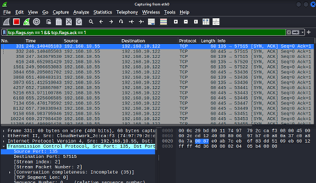
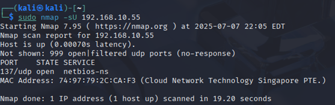

1-	Maquina anfitrion
 
  
  
2-	Comandos que realizan escaneos SYN (stealth scan)
   

3-	Comprobaciones en wireshark – puertos abiertos y cerrados
  
  
4-	Escaneo por UDP
 
5-Escaneo de puertos abiertos en mi red
 
7- escaneo de versión 
  
  
  
9- Captura de trafico 
 
