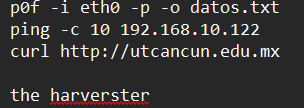
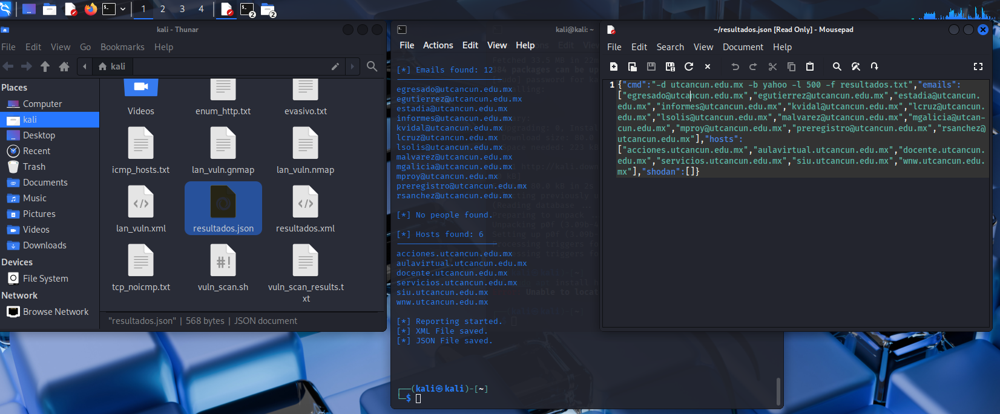
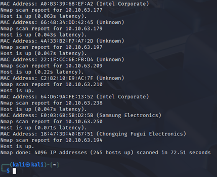
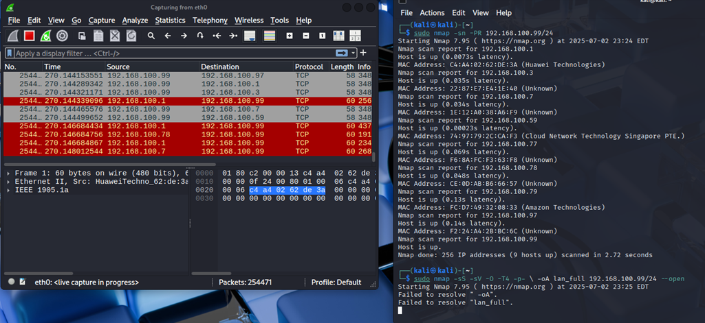
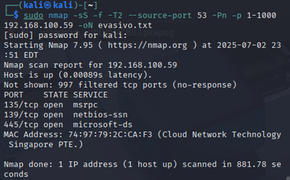

DANIEL COTO NATO
Ejercicio 1: Mapeo completo de tu red local – INGENIERIA PA
Con base en tu segmento de red, realiza un escaneo que te permita identificar todos los hosts activos y los servicios que están corriendo en cada uno. Analiza qué equipos representan un posible riesgo por los servicios expuestos.
 
  
  
En Wireshark deberían ver:
 
 
 
 
 
 
•	Tráfico SYN enviado a múltiples IPs del segmento.
•	 
•	Respuestas SYN-ACK desde los hosts activos.
•	 
•	Tráfico ICMP si usan ping scan.
•	Escaneos dirigidos a múltiples puertos por host.
 
 
  
 
 
 
 
IP	Servicios abiertos	Proveedor	Riesgos identificados
192.168.100.1	53 (DNS), 80 (HTTPS), scripts HTTP fallidos	Huawei Technologies	Medio – DNS abierto sin identificar, posibles fallas XSS/CSRF no concluyentes
192.168.100.3	Ninguno (todos cerrados)	Desconocido	Nulo – sin puertos abiertos
192.168.100.59	135, 139, 445 (Windows SMB)	Microsoft Windows	Alto – servicios SMB expuestos, potencial vector para EternalBlue, SMBv1
192.168.100.77	Ninguno	Desconocido	Nulo – sin puertos abiertos
192.168.100.78	Ninguno	Desconocido	Nulo – sin puertos abiertos
192.168.100.79	1080 (SOCKS5), 8888 (tcpwrapped)	Amazon Technologies	Medio – proxy abierto (SOCKS5) puede ser usado para tunneling
192.168.100.97	7 (echo) (filtrado)	Desconocido	Bajo – echo está filtrado, pero puede ser usado para DoS si abierto
192.168.100.99	Ninguno	(yo - Kali)	Nulo – sin puertos abiertos

________________________________________
Ejercicio 2: Escaneo sigiloso a un host en tu red
Escoge un host dentro de tu red y realiza un escaneo que utilice técnicas de evasión para evitar su detección por firewalls o sistemas de monitoreo. Evalúa si lograste obtener información sin generar tráfico evidente.
Se logró realizar un escaneo sigiloso exitoso al host 192.168.100.59, identificando puertos sensibles abiertos (135, 139, 445), utilizando técnicas de evasión como fragmentación IP, puerto fuente 53 y ritmo bajo de envío. 
 
En Wireshark deberían ver:
•	Tráfico con fragmentación de paquetes TCP/IP.
•	 
•	Uso de un puerto fuente no estándar (ej. 53, 123).
•	 
•	Intervalos largos entre los paquetes (bajo volumen).
•	Tráfico que no completa handshakes TCP.
•	 
________________________________________
Ejercicio 3: Enumeración avanzada de servicios
Identifica un host dentro de tu red que tenga servicios web, FTP, o SSH, y utiliza técnicas avanzadas para obtener información detallada de esos servicios (como banners, versiones, métodos HTTP, etc.).
 
En Wireshark deberían ver:
•	Solicitudes hacia puertos 21, 22, 80, 443, u otros comunes.
•	 
•	Tráfico con comandos FTP, HTTP o SSH.
•	
   
•	Respuestas con datos identificables: versiones de servicios, encabezados HTTP, mensajes de bienvenida de FTP/SSH.
•	 
________________________________________
Ejercicio 4: Detección de hosts sin ICMP habilitado
Encuentra dentro de tu red aquellos hosts que no responden a ping (ICMP), pero que tienen puertos abiertos accesibles. Analiza si puedes detectarlos sin depender de ICMP.
   
   
En Wireshark deberían ver:
•	Escaneos TCP sin tráfico ICMP.
•	 
•	Solicitudes TCP SYN enviadas directamente a puertos específicos.
•	 
•	Respuestas SYN-ACK de hosts que no respondieron al ping.
•	 
